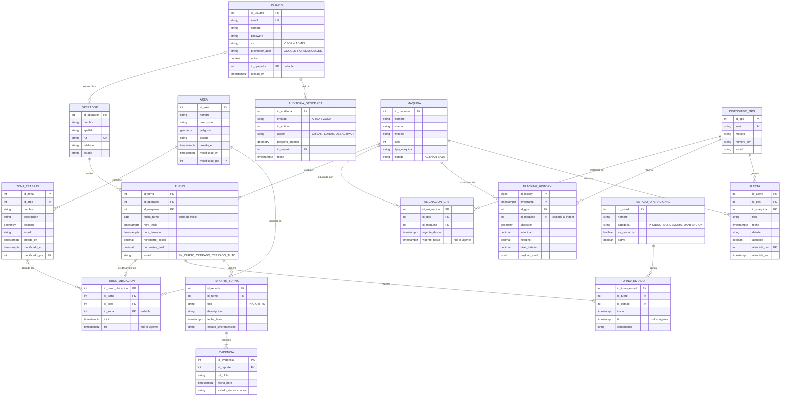

# Diagrama de Entidad-Relación (Base de Datos Aiven)

```mermaid
erDiagram
    USUARIO {
        int id_usuario PK
        string email UK
        string nombre
        string password
        string rol "VISOR o ADMIN"
        string proveedor_auth "GOOGLE o CREDENCIALES"
        boolean activo
        int id_operador FK "nullable"
        timestamptz creado_en
    }
    OPERADOR {
        int id_operador PK
        string nombre
        string apellido
        string rut UK
        string telefono
        string estado
    }
    AREA {
        int id_area PK
        string nombre
        string descripcion
        geometry poligono
        string estado
        timestamptz creado_en
        timestamptz modificado_en
        int modificado_por FK
    }
    ZONA_TRABAJO {
        int id_zona PK
        int id_area FK
        string nombre
        string descripcion
        geometry poligono
        string estado
        timestamptz creado_en
        timestamptz modificado_en
        int modificado_por FK
    }
    AUDITORIA_GEOCERCA {
        int id_auditoria PK
        string entidad "AREA o ZONA"
        int id_entidad
        string accion "CREAR, EDITAR, DESACTIVAR"
        geometry poligono_anterior
        int id_usuario FK
        timestamptz fecha
    }
    MAQUINA {
        int id_maquina PK
        string nombre
        string marca
        string modelo
        int anio
        string tipo_maquina
        string estado "ACTIVA o BAJA"
    }
    DISPOSITIVO_GPS {
        int id_gps PK
        string imei UK
        string modelo
        string numero_sim
        string estado
    }
    ASIGNACION_GPS {
        int id_asignacion PK
        int id_gps FK
        int id_maquina FK
        timestamptz vigente_desde
        timestamptz vigente_hasta "null si vigente"
    }
    TRACKING_HISTORY {
        bigint id_history PK
        timestamptz timestamp PK
        int id_gps FK
        int id_maquina FK "copiado al ingerir"
        geometry ubicacion
        decimal velocidad
        decimal heading
        decimal nivel_bateria
        jsonb payload_crudo
    }
    ALERTA {
        int id_alerta PK
        int id_gps FK
        int id_maquina FK
        string tipo
        timestamptz fecha
        string detalle
        boolean atendida
        int atendida_por FK
        timestamptz atendida_en
    }
    TURNO {
        int id_turno PK
        int id_operador FK
        int id_maquina FK
        date fecha_turno "fecha de inicio"
        timestamptz hora_inicio
        timestamptz hora_termino
        decimal horometro_inicial
        decimal horometro_final
        string estado "EN_CURSO, CERRADO, CERRADO_AUTO"
    }
    TURNO_UBICACION {
        int id_turno_ubicacion PK
        int id_turno FK
        int id_area FK
        int id_zona FK "nullable"
        timestamptz inicio
        timestamptz fin "null si vigente"
    }
    ESTADO_OPERACIONAL {
        int id_estado PK
        string nombre
        string categoria "PRODUCTIVO, DEMORA, MANTENCION"
        boolean es_productivo
        boolean activo
    }
    TURNO_ESTADO {
        int id_turno_estado PK
        int id_turno FK
        int id_estado FK
        timestamptz inicio
        timestamptz fin "null si vigente"
        string comentario
    }
    REPORTE_TURNO {
        int id_reporte PK
        int id_turno FK
        string tipo "INICIO o FIN"
        string descripcion
        timestamptz fecha_hora
        string estado_sincronizacion
    }
    EVIDENCIA {
        int id_evidencia PK
        int id_reporte FK
        string url_blob
        timestamptz fecha_hora
        string estado_sincronizacion
    }

    USUARIO |o--o| OPERADOR : "se vincula a"
    USUARIO ||--o{ AUDITORIA_GEOCERCA : "realiza"
    AREA ||--o{ ZONA_TRABAJO : "contiene"
    OPERADOR ||--o{ TURNO : "realiza"
    MAQUINA ||--o{ TURNO : "usada en"
    TURNO ||--|{ TURNO_UBICACION : "se desarrolla en"
    AREA ||--o{ TURNO_UBICACION : "ubicada en"
    ZONA_TRABAJO |o--o{ TURNO_UBICACION : "ubicada en"
    TURNO ||--|{ TURNO_ESTADO : "registra"
    ESTADO_OPERACIONAL ||--o{ TURNO_ESTADO : "tipifica"
    TURNO ||--o{ REPORTE_TURNO : "genera"
    REPORTE_TURNO ||--|{ EVIDENCIA : "contiene"
    MAQUINA ||--o{ ASIGNACION_GPS : "equipada con"
    DISPOSITIVO_GPS ||--o{ ASIGNACION_GPS : "instalado en"
    DISPOSITIVO_GPS ||--o{ TRACKING_HISTORY : "reporta"
    MAQUINA ||--o{ TRACKING_HISTORY : "posiciones de"
    DISPOSITIVO_GPS ||--o{ ALERTA : "genera"
    MAQUINA ||--o{ ALERTA : "afecta a"
```
