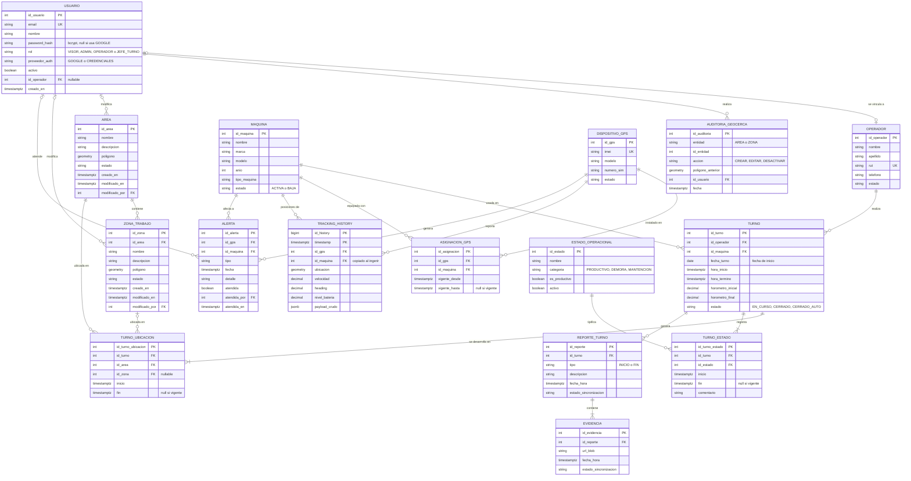

# Base de datos (PostgreSQL + PostGIS en Aiven)

- DDL completo (fuente de verdad): [`database/schema.sql`](database/schema.sql)
- Datos sintéticos de prueba: [`database/seed.sql`](database/seed.sql) (ejecutar después del schema)

Base local desde cero:

```bash
docker exec -i cmp_postgres psql -U cmp_user -d cmp_db -v ON_ERROR_STOP=1 < docs/database/schema.sql
docker exec -i cmp_postgres psql -U cmp_user -d cmp_db -v ON_ERROR_STOP=1 < docs/database/seed.sql
```

## Diagrama de Entidad-Relación



## Tablas

Todas las PK son `SERIAL` salvo `TRACKING_HISTORY` (PK compuesta). Los polígonos y puntos son `GEOMETRY` con SRID 4326.

### Maestras

| Tabla | Propósito | Restricciones |
|---|---|---|
| `OPERADOR` | Persona que opera maquinaria | `rut` UNIQUE |
| `USUARIO` | Cuenta de acceso (app móvil y web) | `email` UNIQUE; `id_operador` UNIQUE (1 usuario por operador); `rol` ∈ `VISOR`, `ADMIN`, `OPERADOR`, `JEFE_TURNO`; `proveedor_auth` ∈ `GOOGLE`, `CREDENCIALES`; `activo` default `TRUE` |
| `AREA` | Geocerca principal de la faena | `estado` en uso: `ACTIVA`, `INACTIVA` |
| `ZONA_TRABAJO` | Subdivisión de un área | `estado` en uso: `ACTIVA`, `INACTIVA` |
| `AUDITORIA_GEOCERCA` | Historial de cambios de áreas y zonas | `entidad` ∈ `AREA`, `ZONA`; `accion` ∈ `CREAR`, `EDITAR`, `DESACTIVAR`; `id_entidad` es polimórfico (sin FK) |
| `MAQUINA` | Equipo de la flota | `estado` ∈ `ACTIVA`, `BAJA` |
| `DISPOSITIVO_GPS` | Equipo de telemetría | `imei` UNIQUE |
| `ESTADO_OPERACIONAL` | Catálogo de estados del turno | `categoria` ∈ `PRODUCTIVO`, `DEMORA`, `MANTENCION`; `activo` default `TRUE` |

### Maquinaria, telemetría y alertas

| Tabla | Propósito | Restricciones |
|---|---|---|
| `ASIGNACION_GPS` | Qué GPS está instalado en qué máquina y desde cuándo | `vigente_hasta` NULL = asignación vigente |
| `TRACKING_HISTORY` | Posiciones GPS recibidas | PK (`id_history`, `timestamp`); `id_maquina` se copia al ingerir; `payload_crudo` JSONB |
| `ALERTA` | Eventos detectados (p. ej. `RALENTI_EXCESIVO`) | `atendida` default `FALSE`; `atendida_por`/`atendida_en` NULL hasta atenderla |

### Gestión de turnos

| Tabla | Propósito | Restricciones |
|---|---|---|
| `TURNO` | Jornada de un operador en una máquina | `estado` ∈ `EN_CURSO`, `CERRADO`, `CERRADO_AUTO`; `hora_termino` y `horometro_final` NULL mientras está en curso |
| `TURNO_UBICACION` | Área/zona donde se desarrolla el turno (historial) | `id_zona` opcional; `fin` NULL = ubicación vigente |
| `TURNO_ESTADO` | Historial de estados operacionales del turno | `fin` NULL = estado vigente |
| `REPORTE_TURNO` | Reporte de apertura o cierre del turno | `tipo` ∈ `INICIO`, `FIN`; `estado_sincronizacion` (`SINCRONIZADO`, `PENDIENTE`, `ERROR_SINCRONIZACION`) |
| `EVIDENCIA` | Foto adjunta a un reporte | `url_blob` NOT NULL |

## Relaciones (foreign keys)

| FK | Desde | Hacia | ON DELETE |
|---|---|---|---|
| `fk_usuario_operador` | `USUARIO.id_operador` | `OPERADOR.id_operador` | SET NULL |
| `fk_area_usuario` | `AREA.modificado_por` | `USUARIO.id_usuario` | SET NULL |
| `fk_zona_area` | `ZONA_TRABAJO.id_area` | `AREA.id_area` | CASCADE |
| `fk_zona_usuario` | `ZONA_TRABAJO.modificado_por` | `USUARIO.id_usuario` | SET NULL |
| `fk_auditoria_usuario` | `AUDITORIA_GEOCERCA.id_usuario` | `USUARIO.id_usuario` | NO ACTION |
| `fk_asig_gps` | `ASIGNACION_GPS.id_gps` | `DISPOSITIVO_GPS.id_gps` | NO ACTION |
| `fk_asig_maquina` | `ASIGNACION_GPS.id_maquina` | `MAQUINA.id_maquina` | NO ACTION |
| `fk_tracking_gps` | `TRACKING_HISTORY.id_gps` | `DISPOSITIVO_GPS.id_gps` | NO ACTION |
| `fk_tracking_maquina` | `TRACKING_HISTORY.id_maquina` | `MAQUINA.id_maquina` | NO ACTION |
| `fk_alerta_gps` | `ALERTA.id_gps` | `DISPOSITIVO_GPS.id_gps` | NO ACTION |
| `fk_alerta_maquina` | `ALERTA.id_maquina` | `MAQUINA.id_maquina` | NO ACTION |
| `fk_alerta_usuario` | `ALERTA.atendida_por` | `USUARIO.id_usuario` | SET NULL |
| `fk_turno_operador` | `TURNO.id_operador` | `OPERADOR.id_operador` | NO ACTION |
| `fk_turno_maquina` | `TURNO.id_maquina` | `MAQUINA.id_maquina` | NO ACTION |
| `fk_tubicacion_turno` | `TURNO_UBICACION.id_turno` | `TURNO.id_turno` | CASCADE |
| `fk_tubicacion_area` | `TURNO_UBICACION.id_area` | `AREA.id_area` | NO ACTION |
| `fk_tubicacion_zona` | `TURNO_UBICACION.id_zona` | `ZONA_TRABAJO.id_zona` | SET NULL |
| `fk_testado_turno` | `TURNO_ESTADO.id_turno` | `TURNO.id_turno` | CASCADE |
| `fk_testado_estado` | `TURNO_ESTADO.id_estado` | `ESTADO_OPERACIONAL.id_estado` | NO ACTION |
| `fk_reporte_turno` | `REPORTE_TURNO.id_turno` | `TURNO.id_turno` | CASCADE |
| `fk_evidencia_reporte` | `EVIDENCIA.id_reporte` | `REPORTE_TURNO.id_reporte` | CASCADE |

## Mapeo a módulos del Backend

| Tablas | Módulo (`src/modules/`) |
|---|---|
| `USUARIO` | `usuarios` |
| `OPERADOR` | `operadores` |
| `AREA`, `ZONA_TRABAJO`, `AUDITORIA_GEOCERCA` | `geocercas` |
| `MAQUINA`, `DISPOSITIVO_GPS`, `ASIGNACION_GPS` | `maquinas` |
| `TRACKING_HISTORY` | `tracking` |
| `ALERTA` | `alertas` |
| `TURNO`, `TURNO_UBICACION`, `TURNO_ESTADO`, `ESTADO_OPERACIONAL` | `turnos` |
| `REPORTE_TURNO`, `EVIDENCIA` | `evidencias` |

## Reglas de negocio sobre los datos

- Un operador y una máquina tienen como máximo un `TURNO` con `hora_termino` NULL (validado en `IniciarTurnoUseCase`).
- Un turno abierto más de 12 h pasa a `CERRADO_AUTO` con `hora_termino` = `hora_inicio` + 12 h y `horometro_final` NULL (`CerrarTurnosExcedidosUseCase` + scheduler cada 5 min).
- Al cerrar un turno (manual o automático) se cierra su `TURNO_UBICACION` vigente.
- `TURNO_UBICACION.id_zona`, si viene, debe pertenecer al `id_area` del mismo registro (validado en la aplicación, no en la BD).

